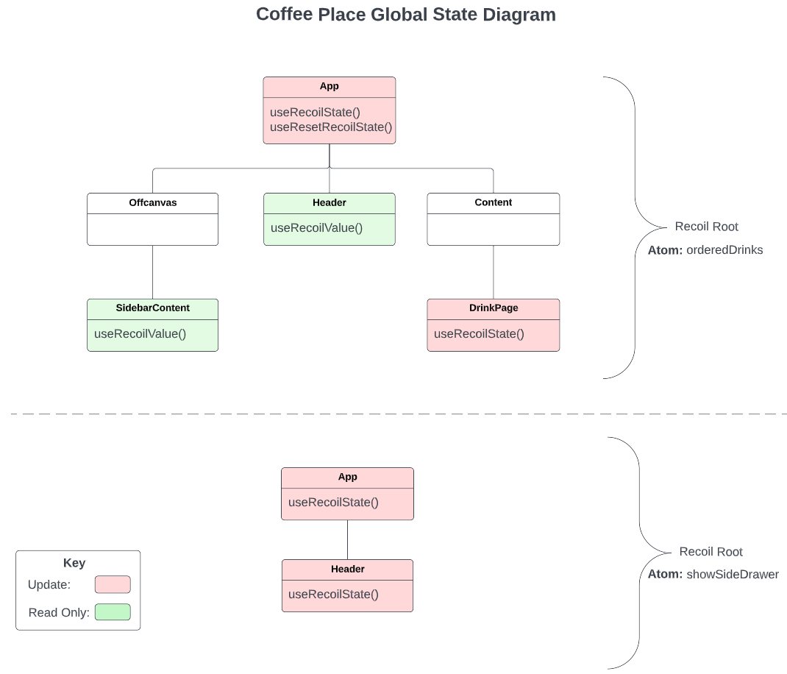

# JavaScript React Coffee Shop
React web application that uses Recoil and React Bootstrap to implement a client side shopping cart for a coffee shop.

# Getting Started
- Clone this repo
- Install dependencies: `npm install`
- Start the app: `npm start`

# Deployment
- Run tests: `npm run test`
- Execute: `/devops/build-deploy.bat`

# Global State Diagram
- Recoil is used to store global state

# Links
- [Recoil](https://recoiljs.org/docs/introduction/installation)
- [React Bootstrap](https://react-bootstrap.github.io/getting-started/introduction/)
